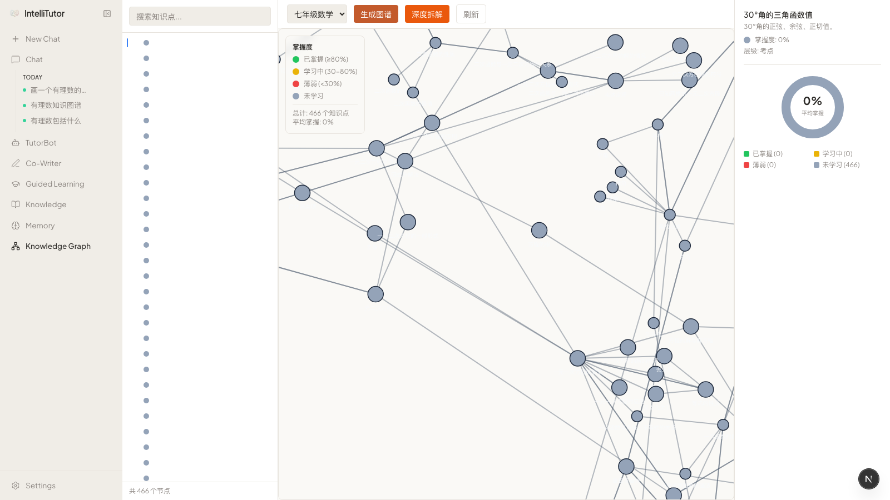
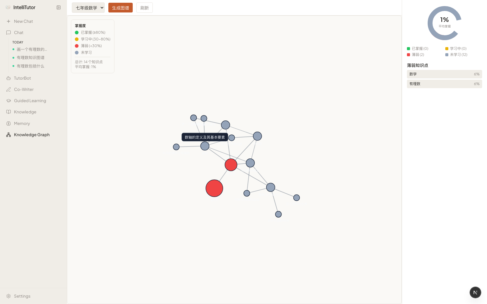
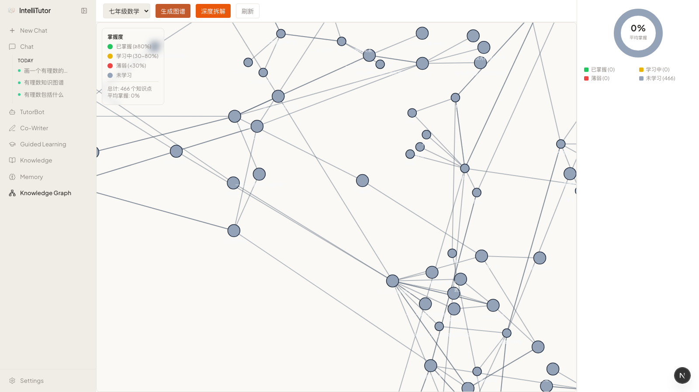
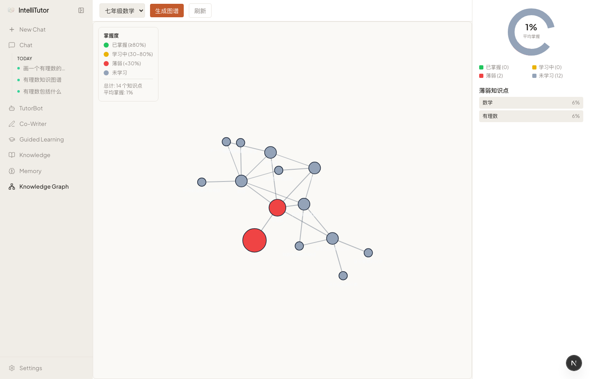

# IntelliTutor — K12 AI 智能学习伴侣

> **不是聊天机器人，是学习引擎。**
> 基于 [DeepTutor](https://github.com/PIGU-PPPgu/DeepTutor)（港大 DSA Lab, Apache-2.0）深度改造，面向中国 K12 场景的全学科智能学习平台。

---

## 🎯 DeepTutor vs IntelliTutor：我们到底多了什么？

DeepTutor 是一个优秀的 **RAG 对话框架**——你上传文档，它回答问题。仅此而已。

IntelliTutor 在此基础上构建了一个 **完整的学习闭环**：

```
DeepTutor 能做的：
  上传文档 → 提问 → 得到回答

IntelliTutor 能做的：
  导入教材（PDF/EPUB/URL）
    → 自动识别学科+拆解知识点（Content Analyzer）
    → 构建交互式知识图谱，追踪每个知识点的掌握度（Knowledge Graph）
    → 生成个性化学习计划，按依赖关系排序（Learning Guide）
    → 苏格拉底式引导对话，教你不直接给答案（Socratic Dialog）
    → 自适应测评，根据表现动态调整难度（Assessment）
    → 间隔重复闪卡，考前复习利器（Flashcard）
    → 生成家长周报，学习进度一目了然（Parent Report）
    → 播客式音频讲解，NotebookLM 体验（Audio Companion）
    → 思维导图，一键生成知识脉络（Mindmap）
    → 测完自动更新知识图谱掌握度，闭环！
```

### 📸 看图说话

**DeepTutor 原版：** 一个简洁的对话界面，上传文件后问答。

**IntelliTutor：**

<table>
<tr>
<td width="50%"></td>
<td width="50%"></td>
</tr>
<tr><td align="center"><b>首页 · 多知识库管理</b></td><td align="center"><b>RAG 对话 · 结构化回答</b></td></tr>

<tr>
<td></td>
<td></td>
</tr>
<tr><td align="center"><b>知识图谱 · 树形导航 + D3力导向图</b></td><td align="center"><b>节点详情 · 掌握度/来源/关联知识点</b></td></tr>

<tr>
<td></td>
<td></td>
</tr>
<tr><td align="center"><b>图谱展开 · 1500+节点递归扩展</b></td><td align="center"><b>交互式图谱 · 小地图+聚焦+导出</b></td></tr>

<tr>
<td></td>
<td></td>
</tr>
<tr><td align="center"><b>知识库 · 多学科内容管理</b></td><td align="center"><b>数学图谱 · 有理数知识体系</b></td></tr>
</table>

---

## 🔥 差异化案例

### 案例 1：七年级数学 · 「相反数」完整学习路径

> **场景：** 学生上传七年级数学教材，系统自动完成从内容理解到测评反馈的全流程。

1. **Content Analyzer** 自动识别为数学教材 → 拆解出「相反数」「绝对值」「数轴」等知识点 + 标注中考考点
2. **Knowledge Graph** 自动构建知识图谱 → 可视化知识点之间的前置依赖关系
3. **Learning Guide** 发现「相反数」掌握度 40% → 生成学习计划：先复习「数轴」→ 再学「相反数」→ 最后练「绝对值」
4. **Socratic Dialog** 学生问"相反数是什么？" → 系统不直接回答，而是引导：
   > "你在数轴上找到 3，再看它的对面是什么数？那 3 和 -3 有什么关系？"
5. **Assessment** 出 3 道题测试 → 学生第 2 题做错（概念混淆）
6. **Flashcard** 自动生成「易错点」闪卡 → 间隔重复安排复习
7. **Knowledge Graph 掌握度自动更新** → 「相反数」从 40% → 75%，学习路径动态调整

**DeepTutor 做不到的：** 没有知识点拆解、没有图谱、没有学习路径规划、没有测评闭环、没有掌握度追踪。

### 案例 2：语文 · 骆驼祥子整本书阅读

> **场景：** 学生导入《骆驼祥子》EPUB，系统辅助整本书阅读理解。

1. **Content Analyzer** 识别为文学作品 → 按「人物」「情节」「主题」「写作手法」四个维度拆解
2. **Knowledge Graph** 构建人物关系图谱（祥子、虎妞、刘四爷…）+ 情节发展线索
3. **Socratic Dialog** 学生问"祥子为什么会堕落？"
   > 系统："你注意到了祥子第三次买车失败后的心理变化了吗？那之前发生了什么？"
4. **Mindmap** 一键生成「祥子三起三落」思维导图
5. **Parent Report** 周报推送：本周阅读进度 60%，理解薄弱点在「社会背景分析」

### 案例 3：自适应测评 → 闪卡 → 图谱闭环

> **场景：** 考前突击复习，系统自动定位薄弱点。

1. **Assessment** 生成一套「有理数混合运算」专项测试（4种题型：选择/填空/判断/简答）
2. 测评结果：运算律掌握度 90%，但有理数大小比较只有 55%
3. **Flashcard** 自动生成「有理数比较」专项闪卡（4种类型：概念/公式/例题/易错）
4. **Knowledge Graph** 红色标注薄弱节点，一键跳转到 Socratic Dialog 进行针对性辅导
5. **Audio Companion** 生成 5 分钟播客：「有理数大小比较的 3 个易错点」

---

## 🆕 10 个全新 Capability

| Capability | 功能 | DeepTutor 有吗？ | 核心价值 |
|-----------|------|:---:|------|
| 🎓 **Content Analyzer** | 6种内容类型自动识别+结构化拆解 | ❌ | 把教材变成结构化数据 |
| 🕸️ **Knowledge Graph** | 交互式知识图谱+掌握度追踪 | ❌ | 学习状态可视化 |
| 📈 **Learning Guide** | 个性化学习计划（拓扑排序+布鲁姆） | ❌ | 告诉你先学什么 |
| 💡 **Socratic Dialog** | 苏格拉底式引导（3种模式） | ❌ | 教会学生思考 |
| 📊 **Assessment** | 中考风格自适应测评 | ❌ | 精准定位薄弱点 |
| 📚 **Flashcard** | 间隔重复闪卡（4种类型） | ❌ | 科学复习 |
| 📋 **Parent Report** | 家长周报 | ❌ | 家校连接 |
| 🔊 **Audio Companion** | NotebookLM 式播客 | ❌ | 听觉学习 |
| 🗺️ **Mindmap** | 思维导图 | ❌ | 知识脉络可视化 |
| 📖 **Content Manager** | PDF/EPUB/URL 真实提取 | ❌ | 多源内容导入 |

**总结：DeepTutor 提供了对话能力（Chat + RAG），我们在此基础上构建了完整的教学引擎。**

---

## 🔧 核心技术改造

| 改造项 | 说明 |
|--------|------|
| **LLM 多模型适配** | GPT-5.4 / GLM-5 / DeepSeek，不再是 OpenAI-only |
| **Embedding 升级** | Qwen3-Embedding-8B（4096维），比原版 text-embedding-3-small 更适合中文 |
| **Stream API 重写** | 6个 Capability 的 `stream.thinking()` → `stream.content()`，前端正常渲染 |
| **Knowledge Graph 引擎** | 全新实现：JSON导入、递归扩展（1500+节点）、掌握度颜色、小地图、面包屑、键盘导航、PNG导出、全屏 |
| **前端 9 个页面** | Chat / Knowledge Graph / Knowledge Base / Settings / Guide / Assessment / Flashcard / Graph / Mindmap |
| **API 50+ 端点** | REST API + SSE 流式，完整覆盖所有功能 |
| **600+ 测试用例** | 从 87 failed 修复到全绿 |

---

## 💰 商业评估

### 可行性分析

| 维度 | 评估 | 说明 |
|------|------|------|
| **技术可行性** | ⭐⭐⭐⭐⭐ | 已完成核心功能开发，17 Capability + 9 Tools 全部实现并测试通过 |
| **产品完整性** | ⭐⭐⭐⭐ | 学习闭环完整（导入→分析→学习→测评→复习→报告），缺微信小程序端 |
| **数据壁垒** | ⭐⭐⭐ | 知识图谱+掌握度追踪是核心壁垒，但需要更多学科内容填充 |
| **成本可控性** | ⭐⭐⭐⭐ | GLM-5 / DeepSeek 等国产模型成本极低，Qwen3 Embedding 便宜 |

### 市场定位

**对标产品：**
- **作业帮/猿辅导**：题库驱动，缺少个性化学习路径 → 我们有 Knowledge Graph + Learning Guide
- **Duolingo**：游戏化做得好，但只有语言 → 我们覆盖全学科
- **Khan Academy (Khanmigo)**：AI 辅导理念接近，但中国市场水土不服 → 我们原生支持中文教材和中考

**差异化优势：**
1. **知识图谱驱动** — 不是"你不会什么就推什么题"，而是真正理解知识点之间的依赖关系
2. **掌握度闭环** — 从学习→测评→图谱更新，数据驱动每一个教学决策
3. **苏格拉底式教学** — 引导思考而非直接给答案，符合教育规律
4. **中国 K12 原生** — 中考考点标注、中文教材解析、家长周报

### 商业模式

| 模式 | 目标用户 | 定价思路 |
|------|---------|---------|
| **To C 订阅** | 中学生/家长 | 免费（基础对话）+ ¥29/月（知识图谱+学习计划+测评） |
| **To B 学校** | 初中/高中 | ¥5000/年/班级（教师后台+学情分析+班级报告） |
| **To B 培训机构** | 教培机构 | 按学生数计费，提供白标定制 |
| **内容授权** | 教材出版社 | 把 Content Analyzer 能力输出为 API |

### 风险与挑战

1. **内容合规** — K12 内容需要审核，涉及教育政策风险
2. **获客成本** — C 端教育产品获客极贵，建议先走 B 端
3. **竞品压力** — 大厂（字节/腾讯/百度）都在做 AI 教育，但大多停留在"AI 答疑"层面
4. **数据冷启动** — 知识图谱需要足够多的教材内容填充，单靠手动上传不够

### 建议路径

```
Phase 1（当前）: 开源获取关注 + 学校试点
  ↓
Phase 2: 接入更多学科教材（合作出版社）+ 微信小程序
  ↓
Phase 3: To B 先行（学校/机构），积累数据和口碑
  ↓
Phase 4: To C 订阅模式，基于真实学情数据做精准推荐
```

---

## 技术栈

| 层 | 技术 |
|---|------|
| 前端 | Next.js 16 + React 19 + TailwindCSS + D3.js |
| 后端 | Python 3.12 + FastAPI + WebSocket + SSE |
| LLM | GPT-5.4 / GLM-5 / DeepSeek（多模型适配） |
| Embedding | Qwen3-Embedding-8B（4096维）|
| RAG | LlamaIndex + 自定义知识库管线 |
| TTS | 硅基流动 siliconflow-tts-001 |

## 快速开始

```bash
# 1. 克隆
git clone https://github.com/PIGU-PPPgu/ai-reading-companion.git
cd ai-reading-companion/deeptutor

# 2. 安装依赖
pip install -e ".[dev]"

# 3. 配置环境变量
cp .env.example .env
# 编辑 .env，填入 LLM API key（支持 OpenAI / 硅基流动 / 自定义端点）

# 4. 启动后端（端口 3001）
deeptutor serve --port 3001

# 5. 启动前端（端口 3782）
cd web && pnpm install
PORT=3782 pnpm dev
```

访问 **http://localhost:3782**

## 项目结构

```
ai-reading-companion/
├── deeptutor/              # DeepTutor fork（核心引擎）
│   ├── deeptutor/
│   │   ├── capabilities/   # 17 Capability 插件（10个全新实现）
│   │   ├── agents/         # ChatAgent, ResearchAgent, ExpansionAgent
│   │   ├── services/       # LLM, RAG, Memory, KnowledgeGraph
│   │   ├── api/            # FastAPI 路由（50+ 端点）
│   │   └── core/           # StreamBus, Context, Protocol
│   ├── web/                # Next.js 前端（9 页面）
│   └── tests/              # 600+ 测试
├── content/                # 教材内容
├── screenshots/            # 截图
└── README.md
```

## 开发进度

| Phase | 内容 | 状态 |
|-------|------|------|
| Phase 0 | 基座搭建 + RAG 对话 | ✅ |
| Phase 1 | Content Analyzer + Learning Guide + Socratic Dialog | ✅ 提前一周 |
| Phase 2 | Assessment + Flashcard + Audio Companion + Parent Report | ✅ 提前两周 |
| Phase 3 | Content Manager + 知识图谱前端增强（两轮） | ✅ |
| Phase 4 | 打磨 + 测试 + Bug 修复 | 🚧 进行中 |
| Phase 5 | 微信小程序 + 上线准备 | 📋 待开始 |

## 最近更新

- **知识图谱 UX 两轮增强**：小地图、双击聚焦邻域、PNG导出、全屏、面包屑、键盘导航、掌握度筛选、薄弱节点定位、脉冲动画、边高亮
- **Flashcard 前端集成** + 测验完成后自动跳回学习路径
- **学习路径深度链接**：Guide → Graph → Quiz 闭环
- **Stream API 修复**（6个Capability）、**TypeScript 零错误**
- **Answer-Now 快速路径**：深度提问支持中断后快速生成

## License

Apache-2.0（基于 [DeepTutor](https://github.com/HKUDS/DeepTutor)）
