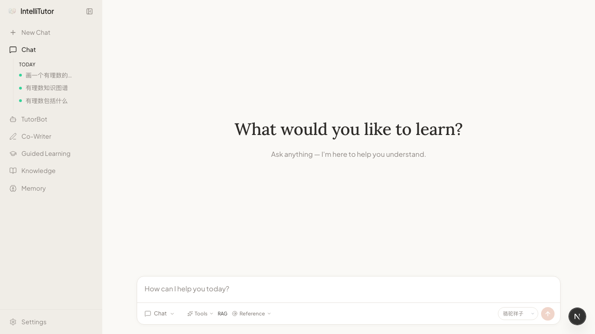
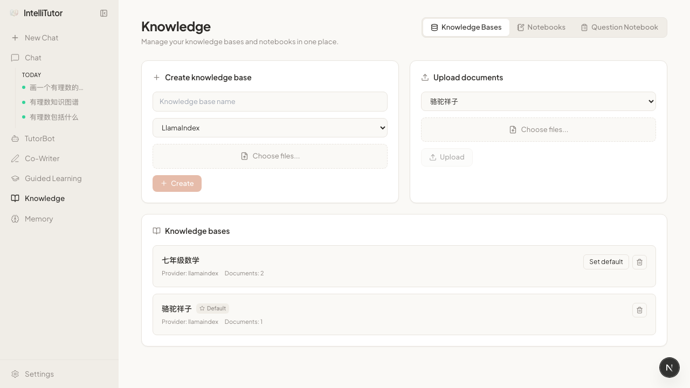
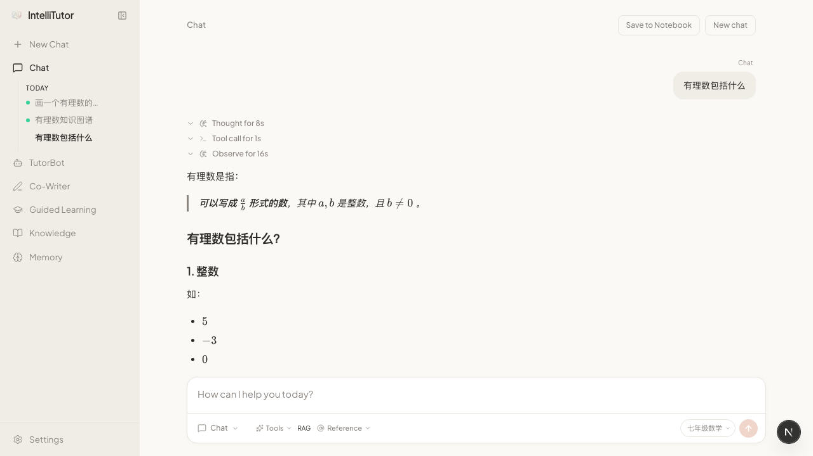
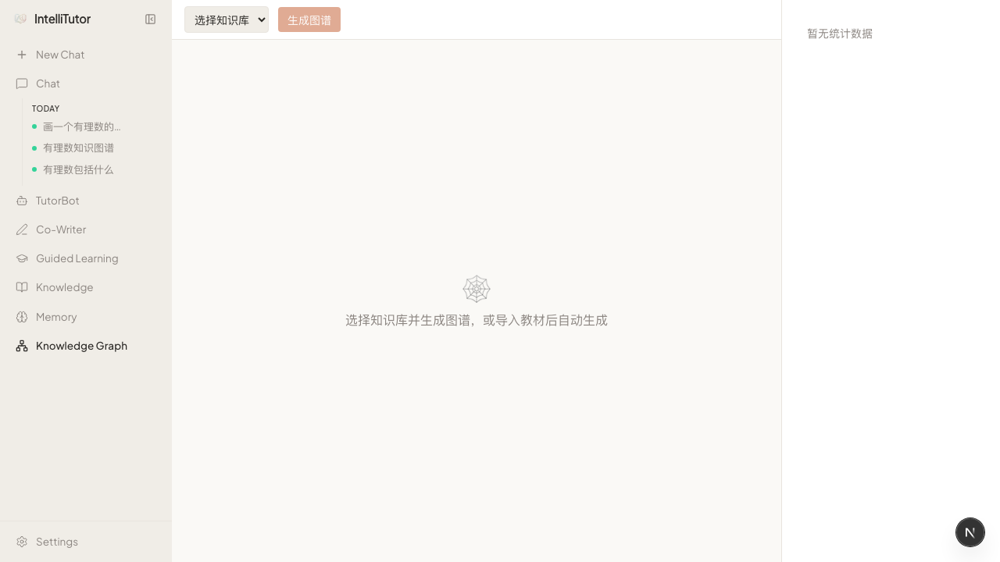

# IntelliTutor - AI智能学习伴侣

> 基于 [DeepTutor](https://github.com/HKUDS/DeepTutor)（Apache-2.0）构建的 K12 全学科智能学习平台

## 截图

### 📚 主页 & 知识库管理
<table>
<tr>
<td></td>
<td></td>
</tr>
</table>

### 💬 智能对话 & 知识图谱
<table>
<tr>
<td></td>
<td></td>
</tr>
</table>

### 🕸️ 交互式知识图谱系统
- **掌握度可视化**：绿=已掌握，黄=学习中，红=薄弱，灰=未学习
- **自动生成**：导入教材自动提取知识点树（学科→章节→知识点→考点）
- **动态点亮**：随对话/测验自动更新节点掌握度
- **D3.js 力导向图**：支持缩放、拖拽、点击交互

## 核心能力（17 Capabilities + 9 Tools）

| 模块 | 功能 | 状态 | 说明 |
|------|------|------|------|
| 🎯 **Chat** | 灵活对话，支持 RAG + Web Search | ✅ | 已验证可用 |
| 🧩 **Deep Solve** | 多步推理与解题 | ✅ | 已验证可用 |
| 📝 **Quiz Generation** | 自动校验的题目生成 | ✅ | 已验证可用 |
| 🔬 **Deep Research** | 多智能体综合研究 | ✅ | 已验证可用 |
| 🎬 **Math Animator** | 数学动画/分镜图生成 | ✅ | 已验证可用 |
| 📊 **Visualize** | SVG / Chart.js / Mermaid 可视化 | ✅ | 已验证可用 |
| 🕸️ **Knowledge Graph** | 交互式知识图谱（D3.js，掌握度追踪） | ✅ | **新实现**：力导向图+树形目录+Expansion Agent |
| 🧠 **Memory Chat** | 三层记忆系统（短/中/长期） | ✅ | 基座自带 |
| 💡 **Socratic Dialog** | 苏格拉底式引导对话 | ✅ | **已实现**：3种模式+错误诊断+知识点关联 |
| 📚 **Flashcard** | 艾宾浩斯间隔重复闪卡 | ⚠️ | 基础功能有，间隔重复逻辑待完善 |
| 🗺️ **Mindmap** | 思维导图生成 | ⚠️ | 基础功能有，样式待优化 |
| 📖 **Content Manager** | 教材/PDF内容导入 | ⚠️ | 能导入，缺少自动类型识别 |
| 📈 **Learning Guide** | 个性化学习计划 | ✅ | **已实现**：拓扑排序排课+每日计划+API |
| 📊 **Assessment** | 学习测评 | ✅ | **已实现**：4题型+自适应+掌握度更新 |
| 📋 **Parent Report** | 家长报告 | ✅ | **已实现**：周报+掌握度+辅导建议 |
| 🔊 **Audio Companion** | 播客式音频回顾 | ✅ | **已实现**：双人对话+硅基流动TTS+后台任务 |
| 🎓 **Content Analyzer** | 内容自动识别+拆解 | ⚠️ | 框架完整，待验证 |

## 技术栈

- **基座**: [DeepTutor](https://github.com/PIGU-PPPgu/DeepTutor) (Apache-2.0 fork)
- **前端**: Next.js 16 + React 19 + TailwindCSS
- **后端**: Python 3.12 + FastAPI + WebSocket
- **LLM**: GPT-5.4 (via api.intellicode.top) / GLM-5 / DeepSeek
- **Embedding**: Qwen3-Embedding-8B (4096维) via 硅基流动
- **RAG**: LlamaIndex + 自定义知识库管线
- **TTS**: 硅基流动 siliconflow-tts-001

## 快速开始

```bash
# 1. 克隆项目
git clone https://github.com/PIGU-PPPgu/ai-reading-companion.git
cd ai-reading-companion

# 2. 安装依赖（DeepTutor 子目录）
cd deeptutor
pip install -e ".[dev]"

# 3. 配置环境变量
cp .env.example .env
# 编辑 .env 填入 LLM API key

# 4. 启动后端
python -m deeptutor serve --port 8001

# 5. 启动前端
cd web
pnpm install
PORT=3782 npx next dev -p 3782
```

访问 http://localhost:3782 即可使用。

## 项目结构

```
ai-reading-companion/
├── deeptutor/              # DeepTutor fork（核心引擎）
│   ├── deeptutor/
│   │   ├── capabilities/   # 17 个 Capability 插件
│   │   ├── agents/         # ChatAgent, ResearchAgent 等
│   │   ├── services/       # LLM, RAG, Memory 服务
│   │   └── api/            # FastAPI 路由
│   ├── web/                # Next.js 前端
│   └── tests/              # 380+ 测试用例
├── content/                # 教材内容（PDF）
├── screenshots/            # 项目截图
└── README.md
```

## 商业化

基于 Apache-2.0 协议，允许：
- ✅ 商业使用（无需付费）
- ✅ 修改品牌/名称
- ✅ 闭源分发
- ⚠️ 需保留原始 LICENSE 和版权声明

## License

Apache-2.0
